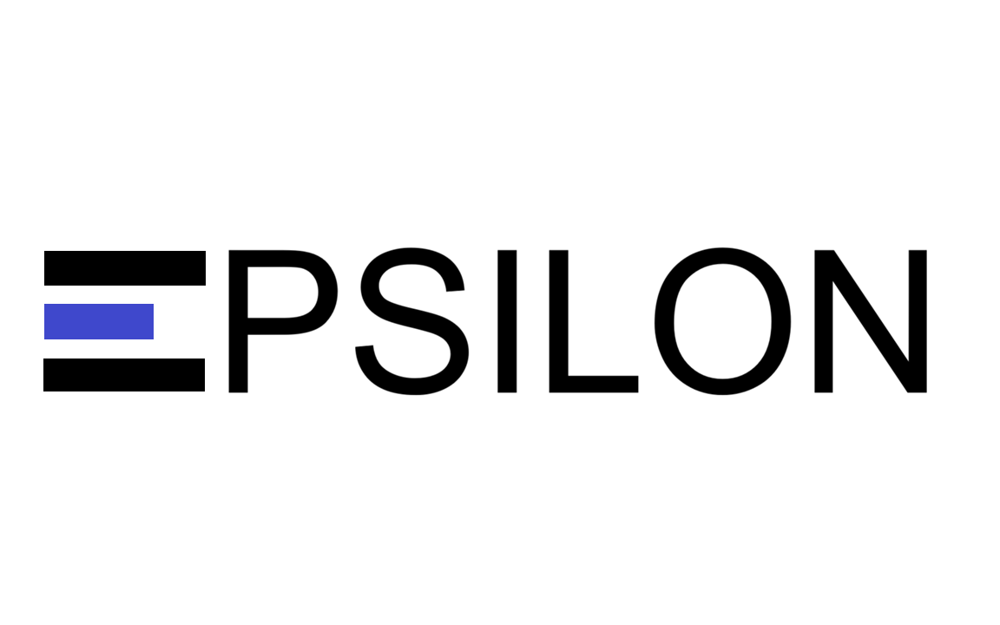

# Welcome to the documentation of Epsilon

Epsilon is a targeted somatic SNV caller for Illumina WGS and WES data. It is taylored towards calling point mutations at very low variant allele fractions.

